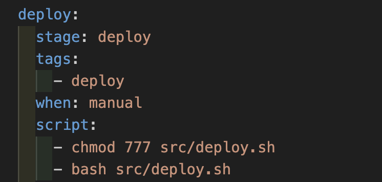
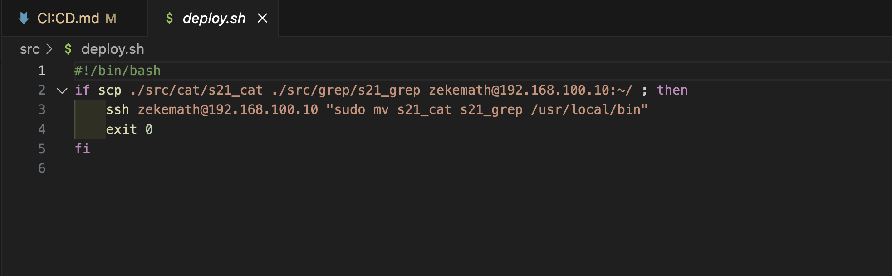
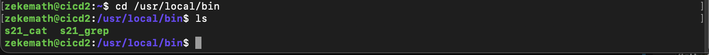

## Part 1. CI/CD

- ##### Поднимем виртуальную машину Ubuntu Server 22.04 LTS

- ##### Скачаем и установим на виртуальную машину **gitlab-runner**.
по методу с [официального сайта](https://docs.gitlab.com/runner/install/linux-manually.html)

- ##### Запустим **gitlab-runner** и зарегистрируем его для использования в текущем проекте (*DO6_CICD*)

### Part 2. Сборка

#### Напишем этап для **CI** по сборке приложений из проекта *C2_SimpleBashUtils*.

- ##### Создаем .gitlab-ci.yml файл в корне  репозитория. В файл добавим этап запуска сборки через мейк файл из проекта _C2_.
- ##### Добавим пункт чтобы файлы, полученные после сборки (артефакты), сохрани в произвольную директорию со сроком хранения 30 дней.

stages: этот раздел определяет последовательность действий.
build-job: этот раздел определяет задание, которое будет выполняться на этапе. 
tags: в этом разделе указаны теги, с которыми должно выполняться задание. 
script: этот раздел определяет команды, которые должны выполняться.
artifacts: в этом разделе определяются артефакты, которые должны быть созданы заданием. В данном случае параметр указывает, что артефакты следует хранить в течение 30 дней.

 ### Part 3. Тест кодстайла

#### Напишем этап для **CI**, который запускает скрипт кодстайла (*clang-format*).

##### Если кодстайл не прошел, то «зафейли» пайплайн.

### Part 4. Интеграционные тесты

#### Напишем этап для **CI**, который запускает интеграционные тесты из того же проекта.

##### Запустим этот этап автоматически только при условии, если сборка и тест кодстайла прошли успешно.

##### В пайплайне отобразим вывод, что интеграционные тесты успешно прошли / провалились.

### Part 5. Этап деплоя

##### Поднимем вторую виртуальную машину *Ubuntu Server 22.04 LTS*.

#### Напишем этап для **CD**, который «разворачивает» проект на другой виртуальной машине.

- ##### Напишем bash-скрипт, который при помощи **ssh** и **scp** копирует файлы, полученные после сборки (артефакты), в директорию */usr/local/bin* второй виртуальной машины.

- ##### В файле _gitlab-ci.yml_ добавим этап запуска написанного скрипта.

- ##### В конфигурационном файле на первой машине добавим строку `environment = ["SSH_AUTH_SOCK=/tmp/ssh-agent"]` Добавление этой строки позволяет указать путь к сокету агента SSH.
- ##### Ключ удаленного сервера добавляем в файл known_hosts на машине gitlab-runner.

- ##### Далее коипруем содержимое shh-ключа на удаленный сервер с помощью клманды
`ssh-copy-id [zekemath@192.168.100.10]`

- ##### После запуска увидим, что файлы усешно скопированы в директорию */usr/local/bin* второй виртуальной машины.

- ##### Этап деплоя успешно пройден.

### Part 6. Дополнительно. Уведомления

- ##### Регестрируем нового Телеграм бота используя "BotFather", получаем API.

- ##### Получаем наш ID используя "GetmyID" бота.

- ##### Пишем скрипт который будет выводить результат о успешном/неуспешном выполнении пайплайна через бота используя полученные ранее данные.

- ##### В .yml файле добавляем инструкции after_script на каждом этапе.

- ##### Проверяем работу бота.
